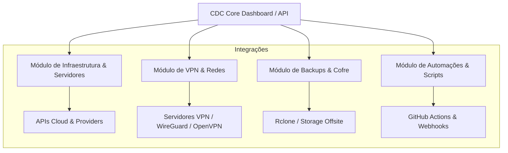

# 🛠️ CDC Core — Centralizador & Canivete de Operações CDC

[](https://www.djangoproject.com/)
[](https://www.python.org/)
[](#)

O **CDC Core** é a plataforma centralizadora desenvolvida para gerenciar a infraestrutura, automações, monitoramento e utilitários de operações da organização **CDC**. Atua como o "canivete suíço" operacional da equipe de Infraestrutura e DevOps.

---

## 🎯 Objetivos da Plataforma

- **Centralização Operacional**: Painel unificado para controle de ativos, infraestrutura e utilitários da CDC.
- **Canivete de Ferramentas (Swiss Army Knife)**: Módulos plugáveis para gestão de redes, VPNs, servidores, cofres de chaves e backups.
- **Automação & Orquestração**: Integração via API e webhooks para tarefas recorrentes de sustentação e DevOps.
- **Governança & Segurança**: Autenticação corporativa, trilha de auditoria e controle de acesso baseado em funções (RBAC).

---

## 🏗️ Arquitetura & Visão de Módulos



---

## 📁 Estrutura do Repositório

```text
Core/
├── README.md                          # Painel principal do projeto e documentação geral
├── docs/                              # Governança, infraestrutura e guias
│   └── diretrizes_documentacao.md     # Diretrizes de documentação e governança CDC
├── core/                              # App Django Principal (Configurações base)
├── apps/                              # Módulos e aplicações Django específicas
│   ├── infra/                         # Gestão de servidores e infraestrutura
│   ├── vpn/                           # Gestão de conexões e acessos VPN
│   └── tools/                         # Utilitários e ferramentas operacionais
├── manage.py                          # CLI de gerenciamento Django
└── requirements.txt                   # Dependências do projeto Python
```

---

## 🛠️ Tecnologias Utilizadas

- **Backend**: Python 3.11+ / Django
- **Banco de Dados**: PostgreSQL / SQLite (Dev)
- **Fila & Tarefas Assíncronas**: Celery + Redis
- **Frontend / Dashboard**: Django Templates + CSS/JS Modulares
- **Deploy & Infra**: Docker / Docker Compose / Systemd

---

## 🚀 Como Executar em Desenvolvimento

### 1. Clonar o repositório
```bash
git clone git@github.com:dxcdc/core.git
cd core
```

### 2. Configurar o ambiente virtual
```bash
python3 -m venv .venv
source .venv/bin/activate
pip install -r requirements.txt
```

### 3. Executar as migrações e iniciar o servidor
```bash
python manage.py migrate
python manage.py runserver
```

---

## 📖 Documentação & Governança

Consulte as diretrizes oficiais em [docs/diretrizes_documentacao.md](docs/diretrizes_documentacao.md) para normas de contribuição, padrões de commit e governança de repositórios CDC.
