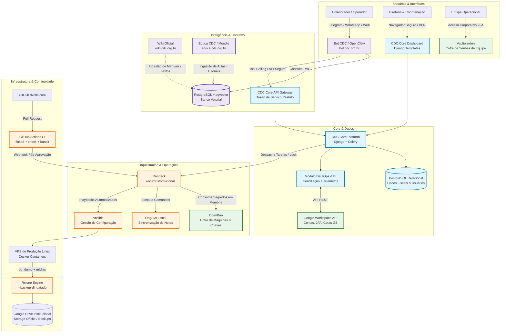

# 🧭 Os 10 Pilares da Engenharia de Plataforma & IA no Ecossistema CDC
## Guia de Maturidade Técnica, Choque de Realidade & Roadmap Operacional

Este documento consolida a análise técnica dos **10 pilares da engenharia moderna de software, plataforma e inteligência artificial**, calibrados estritamente para a realidade operacional, restrições orçamentárias de terceiro setor e ferramentas já adotadas pelo **Centro Dom Helder Camara (CDC)** (incluindo **CDC Core**, **Rundeck**, **OpenBao**, **Vaultwarden**, **Rclone**, **VPN**, **Google Workspace**, **Wiki**, **Educa CDC / Moodle** e a iniciativa **Bot CDC / OpenClaw**).

Para cada pilar (e para o tópico transversal de BI), o documento adota uma **estrutura padrão de 7 camadas**, confrontando a teoria, a operação atual, o exemplo prático, o plano de melhoria e a **auditoria técnica fria (sem métricas de ego)**.

---

## 📊 Matriz Comparativa Completa dos 10 Pilares no CDC

| # | Pilar | O que é | Status Real no CDC | Tecnologias & Ferramentas no CDC | Nível de Maturidade | O que falta / Próximo Passo |
|---|---|---|:---:|---|:---:|---|
| 1 | **Cloud** | Recursos elásticos sob demanda (VMs, storage, bancos) | 🟡 Parcial | VPS Linux (`76.13.xxx.xxx`), Rclone para Google Drive / Storages | Operacional Criativo | Snapshot real da VPS e teste de restore drill documentado |
| 2 | **DevOps** | Cultura de automação unindo Dev (CI) e Operações (CD) | 🟡 Parcial | Rundeck (executor/locks), Ansible, Semaphore, Git | Intermediário (Foco Ops) | GitHub Actions (CI) com checagem de sintaxe e testes pré-merge |
| 3 | **IaC** | Infraestrutura declarada e versionada em código | 🟢 Atendido | Terraform (`ops/terraform`), Ansible (`ops/ansible`), OpenBao, Rundeck | Estruturado | Estado do Terraform em backend remoto e segredos dinâmicos |
| 4 | **Containers** | Aplicação isolada em imagem padronizada | 🟢 Atendido | Dockerfile, Docker na VPS, Gunicorn, Whitenoise | Em Produção | Docker Compose orquestrado e container rodando sem usuário root |
| 5 | **Observabilidade** | Métricas, Logs, Traces e BI de Negócio | 🟡 Parcial | Logs Gunicorn, scripts healthcheck, BI / DataOps (`apps/dataops`) | Intermediário em Negócio | Uptime Kuma (alertas Telegram), Sentry e rota `/healthz` |
| 6 | **IA Generativa** | Modelos (LLMs) para leitura, síntese e linguagem | 🟡 Em Andamento | `bot.cdc.org.br`, OpenClaw, modelos de visão/linguagem | Piloto / Validação | Saídas estritas em JSON e conexão direta de leitura com o CDC Core |
| 7 | **Context Engineering** | Curadoria e injeção do contexto exato no prompt | 🟢 Rico (Acervo) / 🟡 Conexão IA | Wiki (`wiki.cdc.org.br`), Educa CDC Moodle (`educa.cdc.org.br`) | Base Pronta | Ingestão vetorial (RAG via `pgvector`) conectada ao Bot CDC |
| 8 | **Harness Engineering** | Bancada isolada para testes rápidos e evals de IA | 🔴 Inicial | Testes pontuais no Django | Básico | Mocks offline da API do OngSys e dataset de 50 testes para o bot |
| 9 | **Agentes** | Sistemas autônomos com metas, memória e ferramentas | 🟡 Em Andamento | `bot.cdc.org.br`, OpenClaw, rotinas procedurais no Rundeck | Piloto em estruturação | Camada de ferramentas seguras (APIs de serviço) e Human-in-the-Loop |
| 10 | **Governança** | Segurança, cofres, controle de acessos e conformidade | 🟢 Avançado | OpenBao, Vaultwarden, VPN, Google Workspace APIs, 2FA, RBAC | Maduro e em Expansão | Trilha de auditoria (`django-auditlog`) e conformidade formal LGPD |

---

## 📐 Arquitetura Alvo Integrada do Ecossistema CDC

O diagrama abaixo ilustra como todas as peças do ecossistema se conectam de ponta a ponta, eliminando sobreposições e garantindo segurança, rastreabilidade e inteligência operacional:



---

# ⚡ Choque de Realidade & Alinhamento (Sem Métricas de Ego)
## Auditoria Técnica dos 10 Pilares & BI na Estrutura de 7 Camadas

> [!WARNING]
> **Por que esta seção existe?**  
> Na engenharia de software, existe uma armadilha frequente chamada **"Métricas de Ego"**: a tendência de acreditar que uma prática está consolidada apenas porque instalamos uma ferramenta, criamos uma pasta no repositório ou temos uma documentação escrita.  
> Esta seção faz uma **auditoria técnica fria, sem rodeios e baseada no código real** do repositório para separar o que é **realidade em produção** do que é apenas **intenção, protótipo ou ilusão operacional**.
> 
> Cada um dos 10 pilares (e o tópico transversal de BI & DataOps) é analisado sob a **estrutura padrão de 7 camadas**:
> 1. *O que é?*  
> 2. *Como o CDC atende hoje?*  
> 3. *Exemplo Prático no CDC:*  
> 4. *Como podemos melhorar & O que falta:*  
> 5. *A Percepção (Ego):*  
> 6. *A Realidade Técnica no Código:*  
> 7. *Observação Crítica:*  

```text
┌────────────────────────────────────────────────────────────────────────────────────────┐
│                              RESUMO DO CHOQUE DE REALIDADE                             │
├────────────────────────┬───────────────────────────────────┬───────────────────────────┤
│ Pilar                  │ A Percepção (Métrica de Ego)      │ A Realidade Crua no Código│
├────────────────────────┼───────────────────────────────────┼───────────────────────────┤
│ 1. Cloud               │ "Estamos em nuvem com Rclone"     │ VPS fixa com cópia de dir │
│ 2. DevOps              │ "Temos Rundeck, logo temos DevOps"│ Falta CI; zero testes Git │
│ 3. IaC                 │ "Infra codificada em Terraform"   │ main.tf só tem comando echo│
│ 4. Containers          │ "Aplicação 100% containerizada"   │ Sem compose orquestrado   │
│ 5. Observabilidade     │ "Monitoramos com logs"            │ Reativo; zero alertas     │
│ 6. IA Generativa       │ "Bot integrado às operações"      │ Chatbot isolado do Core   │
│ 7. Context Engineering │ "Temos Wiki e Moodle prontas"     │ Zero código RAG/vetorial  │
│ 8. Harness Engineering │ "Código coberto por testes"       │ Sem mocks; zero evals IA  │
│ 9. Agentes             │ "OpenClaw é nosso agente autônomo"│ Não executa tools no Core │
│ 10. Governança         │ "Segurança e cofres resolvidos"   │ O mais maduro, mas sem log│
│ BI & DataOps           │ "BI implementado no dataops"      │ Apenas models e dados fake│
└────────────────────────┴───────────────────────────────────┴───────────────────────────┘
```

---

## 1. ☁️ Cloud (Computação em Nuvem)

* **O que é?**  
  O fornecimento sob demanda de poder computacional, armazenamento, bancos de dados e redes via internet por provedores especializados, eliminando equipamentos físicos locais e custos de manutenção de datacenter próprio.

* **Como o CDC atende hoje?**  
  Devido a restrições de orçamento típicas de ONGs, o CDC adotou uma arquitetura híbrida e pragmática: uma VPS Linux dedicada (`76.13.xxx.xxx`) aliada ao **Rclone** sincronizando dados, bancos e mídias para provedores de storage em nuvem (como Google Drive corporativo / storages offsite).

* **Exemplo Prático no CDC:**  
  Uma rotina periódica no cron/Rundeck que gera o `pg_dump` do banco de dados do CDC Core, compacta mídias e executa:  
  `rclone sync /backups remote-drive:cdc-backups/core/ --backup-dir remote-drive:cdc-backups/historico/$(date +%Y-%m-%d)`

* **Como podemos melhorar & O que falta:**  
  * Habilitar snapshot automático de disco no painel do provedor de VPS (quando viável financeiramente).
  * Criar e documentar um procedimento trimestral de teste de recuperação de desastres (*Restore Drill*): baixar os dados do Rclone em uma máquina zerada e validar se o banco restaura com integridade.

* **A Percepção (Ego):**  
  *"Somos uma organização orientada a nuvem porque temos servidores remotos e backups em nuvem via Rclone."*

* **A Realidade Técnica no Código:**  
  Temos uma **hospedagem tradicional em VPS única** com IP fixo e um script de cópia de arquivos. Não há elasticidade (*auto-scaling*), não há banco gerenciado em nuvem, não há separação de aplicação e persistência, e não há balanceamento de carga. Se o nó físico da VPS falhar, o CDC Core sai do ar instantaneamente.

* **Observação Crítica:**  
  Essa estratégia é inteligente e excelente para o orçamento do terceiro setor, mas **não é arquitetura Cloud-Native**. É hospedagem tradicional virtualizada com replicação de arquivos.

---

## 2. ♾️ DevOps (Desenvolvimento + Operações)

* **O que é?**  
  A cultura, práticas e ferramentas que unem o desenvolvimento de software e as operações de infraestrutura, com foco em automação contínua de testes, integração (CI) e entrega/deploy (CD).

* **Como o CDC atende hoje?**  
  O CDC possui uma perna de **Ops/Orquestração forte**: utiliza **Rundeck**, **Ansible** e **Semaphore** para executar tarefas, gerenciar deploys e processar filas (como o processamento do OngSys com locks e timeouts institucionais).

* **Exemplo Prático no CDC:**  
  O playbook `02_deploy_core.yml` que puxa a versão mais recente do código no Git, roda as migrações do Django e coleta os arquivos estáticos na VPS, comandado pelo painel do Rundeck.

* **Como podemos melhorar & O que falta:**  
  * Implementar **GitHub Actions** em `dxcdc/core` disparados a cada `git push` e `Pull Request`, executando checagens de sintaxe (`flake8`), segurança (`bandit`) e integridade do Django (`python manage.py check`) antes de qualquer merge.
  * Conectar o término aprovado do GitHub Actions a um webhook seguro que notifique o Rundeck para iniciar o deploy na VPS.

* **A Percepção (Ego):**  
  *"Temos cultura DevOps ativa porque usamos Rundeck, Ansible e Semaphore para deploys."*

* **A Realidade Técnica no Código:**  
  O Rundeck funciona essencialmente como um **"cron corporativo com interface web bonita"**. A perna de **Dev / CI (Integração Contínua)** inexiste no repositório `dxcdc/core`. Qualquer desenvolvedor pode cometer um erro de digitação ou quebrar imports na branch `main`, e nenhuma ferramenta automatizada no GitHub impede o código quebrado de subir para a produção.

* **Observação Crítica:**  
  Automatizar tarefas operacionais (Ops) sem ter testes e validações automáticas antes do merge (CI) é apenas metade do caminho. Não temos DevOps pleno; temos automação de tarefas assistida.

---

## 3. ⌨️ IaC (Infrastructure as Code) & Divisão de Papéis

* **O que é?**  
  Gerenciamento, provisionamento e configuração de servidores, redes e serviços por meio de arquivos de código versionados em Git (ex: Terraform, OpenTofu, Ansible), eliminando configurações manuais via painel web ou SSH ("ClickOps").

* **Como o CDC atende hoje?**  
  Existe a estrutura de diretórios [`ops/terraform/`](ops/terraform/) e [`ops/ansible/`](ops/ansible/) com papéis definidos:
  * **Terraform:** Declaração de recursos brutos.
  * **Ansible:** Configuração do SO, pacotes, Docker, Nginx e firewall UFW.
  * **OpenBao:** Armazenamento seguro de tokens e credenciais.
  * **Rundeck:** Orquestração e execução de rotinas operacionais.
  * **Rclone:** Replicação e transporte de dados para a nuvem.

* **Exemplo Prático no CDC:**  
  O playbook `01_setup_server.yml` preparando o ambiente do servidor, instalando Docker e ajustando permissões em `/etc/cdc/`.

* **Como podemos melhorar & O que falta:**  
  * Armazenar o estado do Terraform (`terraform.tfstate`) em backend compartilhado seguro com trava de concorrência.
  * Integrar o Ansible e o Rundeck para consumirem chaves do OpenBao diretamente em memória (via AppRole), sem gravar arquivos estáticos `.env` no disco da VPS.

* **A Percepção (Ego):**  
  *"Nossa infraestrutura está padronizada e descrita como código no Terraform."*

* **A Realidade Técnica no Código:**  
  Ao inspecionar o arquivo [`ops/terraform/main.tf`](ops/terraform/main.tf), encontramos:
  ```hcl
  resource "null_resource" "vps_production_node" {
    provisioner "local-exec" {
      command = "echo 'Nave Mãe conectada à VPS de Produção: ${var.vps_ip}'"
    }
  }
  ```
  O Terraform **não provisiona nada**. Não cria a máquina na nuvem, não define firewalls, não reserva discos e não cria DNS. A VPS foi contratada manualmente clicando no painel da empresa de hospedagem (*ClickOps*).

* **Observação Crítica:**  
  O Terraform atualmente é apenas um arquivo esqueleto/decorativo. O Ansible faz um bom trabalho na configuração do Linux, mas a infraestrutura física/cloud ainda é 100% manual.

---

## 4. 📦 Containers (Docker)

* **O que é?**  
  Tecnologia de empacotamento que isola uma aplicação e todas as suas dependências em uma imagem padronizada (Docker/OCI), garantindo que ela funcione exatamente da mesma forma no computador do desenvolvedor e no servidor de produção.

* **Como o CDC atende hoje?**  
  O CDC Core já conta com [`Dockerfile`](Dockerfile), [`.dockerignore`](.dockerignore) e utiliza containers para rodar o Django com Gunicorn e bibliotecas de sistema na VPS.

* **Exemplo Prático no CDC:**  
  Executar a aplicação com `docker build -t cdc-core . && docker run -p 8000:8000 cdc-core` garantindo a mesma versão do Python 3.11 e bibliotecas de manipulação de relatórios.

* **Como podemos melhorar & O que falta:**  
  * Criar um arquivo `docker-compose.production.yml` oficial unindo CDC Core, PostgreSQL, Redis, Celery Worker e Nginx Reverse Proxy em rede interna isolada.
  * Configurar execução sob usuário não-root no Dockerfile para proteção contra escalada de privilégios.
  * Publicar imagens versionadas no GitHub Container Registry (GHCR).

* **A Percepção (Ego):**  
  *"Nossos sistemas rodam de forma moderna e conteinerizada em produção."*

* **A Realidade Técnica no Código:**  
  Existe um `Dockerfile` funcional que empacota o Django com Gunicorn, mas **não existe um ambiente de produção orquestrado**. O banco de dados PostgreSQL roda de forma separada ou no host, não há `docker-compose.production.yml` oficial amarrando os serviços em rede interna segura, o container roda com privilégios de usuário root e as imagens não são versionadas em um Container Registry.

* **Observação Crítica:**  
  Estamos no nível do "Docker básico de desenvolvimento". Falta a padronização formal da orquestração de containers para produção.

---

## 5. 📈 Observabilidade

* **O que é:**  
  A capacidade de entender em tempo real o que está acontecendo dentro da aplicação e da infraestrutura através dos 3 pilares: **Métricas** (CPU, RAM, requisições/segundo), **Logs** (histórico cronológico estruturado) e **Traces** (tempo gasto em cada função ou requisição).

* **Como o CDC atende hoje?**  
  Nível básico e reativo. Existem logs de texto locais gerados pelo Django/Gunicorn e o playbook `03_system_health.yml` executado manualmente via SSH quando há suspeita de instabilidade.

* **Exemplo Prático no CDC:**  
  Uma sincronização do OngSys falha por timeout de rede. Hoje, a equipe precisa acessar o terminal da VPS e ler arquivos de log manualmente para descobrir o que houve.

* **Como podemos melhorar & O que falta:**  
  * Subir um container gratuito do **Uptime Kuma** na VPS para testar o CDC Core e o `bot.cdc.org.br` a cada 60 segundos com alertas no Telegram/Discord.
  * Adicionar o **Sentry** ao Django para capturar qualquer exceção 500 informando a linha exata de código.
  * Criar um endpoint `/healthz` no Core que verifica a conectividade com o banco e o Redis em milissegundos.

* **A Percepção (Ego):**  
  *"Acompanhamos a saúde do sistema através de logs do Django e scripts de verificação."*

* **A Realidade Técnica no Código:**  
  **Não temos observabilidade.** Temos apenas leitura manual de logs em arquivos de texto quando alguém avisa que algo quebrou. Se o Gunicorn travar ou a conexão com o banco cair em um sábado de madrugada, a equipe só descobrirá na segunda-feira. Não há métricas de CPU/RAM em tempo real, não há rastreamento de exceções (Sentry) e não há alerta automático de queda.

* **Observação Crítica:**  
  Monitoramento não é rodar um playbook manual quando há suspeita de erro; monitoramento é o sistema gritar no celular do administrador no exato instante em que a falha ocorre.

---

## 6. ✨ IA Generativa

* **O que é?**  
  O motor cognitivo baseado em Grandes Modelos de Linguagem (LLMs como Gemini, GPT, Claude, LLaMA) capaz de interpretar textos longos, ler imagens/PDFs (visão computacional), extrair dados não estruturados e sintetizar informações em linguagem natural.

* **Como o CDC atende hoje?**  
  Iniciativa pioneira em andamento: o CDC colocou no ar o portal **`http://bot.cdc.org.br/`** utilizando a estrutura **OpenClaw**.

* **Exemplo Prático no CDC:**  
  Um colaborador envia no chat do bot a foto de uma nota fiscal ou recibo de transporte. A IA generativa lê o texto da foto (OCR semântico), extrai CNPJ, data e valor, e devolve os dados estruturados para conferência.

* **Como podemos melhorar & O que falta:**  
  * Padronizar as chamadas de modelo com schemas de saída em JSON estrito (Structured Outputs), impedindo respostas em texto livre quando o sistema precisa de dados contábeis exatos.
  * Conectar o motor de IA generativa do `bot.cdc.org.br` diretamente às rotinas de backend do CDC Core.

* **A Percepção (Ego):**  
  *"Já estamos aplicando IA Generativa nas operações do CDC com o `bot.cdc.org.br` e o OpenClaw."*

* **A Realidade Técnica no Código:**  
  Temos uma interface web de chat no ar em estágio piloto/experimental, mas ela está **completamente isolada do CDC Core**. O bot não lê notas fiscais do banco de dados, não analisa inconsistências do OngSys, não audita relatórios de transportes e não possui saídas estruturadas em JSON conectadas aos sistemas da ONG.

* **Observação Crítica:**  
  Colocar um modelo de linguagem para conversar em uma página web é simples; a verdadeira IA Generativa aplicada à engenharia é aquela integrada às regras de negócio e às rotinas da instituição.

---

## 7. 🧠 Context Engineering (Engenharia de Contexto)

* **O que é?**  
  A técnica de estruturar, curar, filtrar e injetar o conjunto exato de informações (regras de negócio, histórico relevante, trechos de documentos via RAG - *Retrieval-Augmented Generation*, metadados) no prompt da IA, garantindo respostas precisas, sem alucinações e dentro do limite da janela de contexto.

* **Como o CDC atende hoje?**  
  O CDC possui o acervo institucional mais rico e estruturado do terceiro setor:
  1. **Wiki Oficial (`https://wiki.cdc.org.br/`):** Manuais de compras, regimentos internos, diretrizes de documentação, editais e regras de processos.
  2. **Educa CDC / Moodle (`https://educa.cdc.org.br/`):** Cursos, vídeo-aulas práticas e tutoriais passo a passo de como operar os sistemas e rotinas do CDC.

* **Exemplo Prático no CDC:**  
  Um novo colaborador pergunta ao bot: *"Como eu solicito diária de viagem ou lanço combustível?"*. O pipeline de contexto busca o artigo na Wiki e a aula no Educa CDC, respondendo:  
  > *"Para solicitar diária, o procedimento exige preenchimento prévio no formulário oficial com 48h de antecedência.*  
  > 📖 **Artigo da Wiki:** [Solicitação de Diárias](https://wiki.cdc.org.br/)  
  > 🎓 **Vídeo-aula prática:** [Módulo 2: Viagens no Educa CDC](https://educa.cdc.org.br/)*"

* **Como podemos melhorar & O que falta:**  
  * Criar rotina agendada no Rundeck que faz a leitura dos artigos da Wiki e do catálogo do Moodle, gerando fragmentos com embeddings vetoriais salvos no PostgreSQL via `pgvector`.
  * Integrar a busca vetorial ao prompt do `bot.cdc.org.br`.

* **A Percepção (Ego):**  
  *"Nosso contexto está bem atendido porque já temos a Wiki oficial (`wiki.cdc.org.br`) e os cursos do Educa CDC / Moodle (`educa.cdc.org.br`)."*

* **A Realidade Técnica no Código:**  
  **Esta é a maior ilusão/confusão conceitual.** Ter Wiki e Moodle significa que o CDC tem *excelente documentação humana*. Engenharia de Contexto é *código de software*: envolve web scrapers/APIs que extraem esses textos, algoritmos que fatiam os artigos (*chunking*), modelos que geram representações matemáticas (*embeddings*) e tabelas vetoriais (`pgvector`) que alimentam a IA. No momento, **não há uma única linha de código implementando isso**. A IA não consegue ler nenhuma página da Wiki nem nenhuma aula do Moodle hoje.

* **Observação Crítica:**  
  Temos a jazida de minério (o texto humano), mas não construímos a esteira nem a fábrica (a engenharia de software de contexto).

---

## 8. ⚙️ Harness Engineering (Engenharia de Testes, Mocks & Evals)

* **O que é?**  
  A infraestrutura de bancada de testes ("arnês") construída para testar softwares e IAs de maneira **isolada, rápida e segura**, dividida em duas áreas:
  1. **Harness de Software:** Mocks e simuladores que entregam respostas falsas pré-gravadas da API do OngSys ou Google Drive, permitindo testar seu código em 3 segundos no notebook sem internet e sem risco de mexer em dados reais.
  2. **Harness de IA (Evals):** Uma bateria com 50 perguntas reais de colaboradores com suas respostas ideais esperadas para testar se o bot continua respondendo com precisão após alterações de código.

* **Como o CDC atende hoje?**  
  Nível básico e incipiente. Existe a pasta de testes no app `integrations`, mas a maior parte das rotinas precisa bater nos sistemas reais para ser validada.

* **Exemplo Prático no CDC:**  
  Criar um arquivo `fixtures/ongsys_mock_transportes.json` com dados de 20 viagens. Quando você roda `pytest`, o sistema processa esses dados em 2 segundos na sua máquina sem tocar na VPS e sem bater no OngSys real, confirmando que o algoritmo de cálculo está perfeito.

* **Como podemos melhorar & O que falta:**  
  * Adicionar bibliotecas de mock (`responses` ou `unittest.mock`) nas suítes de teste do Django.
  * Montar uma planilha/JSON com as 30 a 50 perguntas mais frequentes feitas ao `bot.cdc.org.br` com suas respostas ideais para criar o primeiro benchmark de avaliação contínua.

* **A Percepção (Ego):**  
  *"Nosso código possui suítes de testes na pasta `tests/` garantindo a estabilidade."*

* **A Realidade Técnica no Código:**  
  A pasta de testes possui pouquíssimos testes pontuais. Não há simuladores (*mocks*) para testar as rotinas de sincronização do OngSys ou da API do Google sem internet, tornando os testes lentos e dependentes de rede externa. No lado da IA, o cenário é de **zero evals**: não existe um banco de 50 perguntas padrão para avaliar se uma mudança de prompt piorou as respostas do bot.

* **Observação Crítica:**  
  Sem harness, qualquer alteração no código de integração ou no bot de IA é um teste às cegas feito diretamente em produção com usuários reais.

---

## 9. 🤖 Agentes (AI Agents)

* **O que é:**  
  Diferente da IA Generativa (que apenas pensa e escreve), o **Agente de IA possui mãos e ferramentas**: ele possui um loop de planejamento, memória persistente e capacidade de acionar ferramentas externas (*Tool Calling* / APIs) para cumprir objetivos complexos em múltiplos passos.

* **Como o CDC atende hoje:**  
  Em andamento através da iniciativa **`bot.cdc.org.br`** e **OpenClaw**, aliada às rotinas determinísticas do Rundeck.

* **Exemplo Prático no CDC:**  
  O operador solicita no bot: *"Sincronize os dados fiscais de ontem e me avise se houve divergência."*  
  O **Agente**:
  1. Chama a ferramenta `trigger_rundeck_job("sync_fiscal")`;
  2. Monitora o status da tarefa no CDC Core;
  3. Identifica duas notas inconsistentes;
  4. Devolve o resumo formatado com os links das notas no chat.

* **Como podemos melhorar & O que falta:**  
  * Criar funções com permissões restritas (APIs de serviço) no CDC Core para que o OpenClaw possa consultá-las como ferramentas (*tool calling*), sem ter acesso de superusuário ao banco.
  * Implementar controles de aprovação humana (*Human-in-the-Loop*).

* **A Percepção (Ego):**  
  *"O OpenClaw / `bot.cdc.org.br` é um agente inteligente autônomo trabalhando pelo CDC."*

* **A Realidade Técnica no Código:**  
  Um **Agente** por definição possui loop de planejamento, memória de longo prazo e **ferramentas ativas (*Tool Calling*)** para agir no sistema. O bot atual é um **chatbot conversacional**: ele conversa, mas não tem permissão nem código para acionar ferramentas no CDC Core.

* **Observação Crítica:**  
  Chamar um chatbot de agente é inflar o status da ferramenta. Ele só se tornará um agente quando o CDC Core expuser APIs de ferramentas seguras para ele interagir.

---

## 10. 🛡️ Governança, Identidade & Segurança

* **O que é:**  
  O ecossistema de proteção de dados, gestão de segredos, controle de acessos baseado em funções (RBAC), auditoria inalterável de ações e conformidade jurídica (LGPD e Marco Regulatório do Terceiro Setor).

* **Como o CDC atende hoje?**  
  Estrutura muito avançada e exemplar para o terceiro setor:
  1. **OpenBao:** Gestão centralizada de credenciais de máquinas e serviços (fork livre do Vault).
  2. **Vaultwarden:** Gerenciador de senhas corporativas da equipe operacional e administrativa.
  3. **VPN (Rede Privada):** Acesso a serviços e bancos restrito por túnel criptografado.
  4. **Google Workspace APIs:** Automação de contas corporativas `@cdc.org.br` e controle de identidade.
  5. **Telemetria de Segurança & 2FA:** Obrigatoriedade do segundo fator de autenticação e coleta de logs.
  6. **Controle Granular no Core:** Papéis bem definidos (observador, operador de testes, operador de sincronização, leitor de relatórios).

* **Exemplo Prático no CDC:**  
  Um novo operador de dados entra no projeto. Via API do Google Workspace sua conta é provisionada; seus acessos a senhas compartilhadas são liberados no Vaultwarden com 2FA obrigatório; para acessar o Rundeck ou a VPS ele se conecta pela VPN; e o script do CDC Core consome o token da API fiscal puxando do OpenBao em tempo de execução sem que o operador jamais veja a senha em texto claro.

* **Como podemos melhorar & O que falta:**  
  * Instalar `django-auditlog` para manter uma trilha inalterável de quem modificou cada registro fiscal ou contábil.
  * Estruturar a política e mecanismos de expurgo/anonimização de dados de beneficiários para conformidade plena com a LGPD.
  * Injetar segredos do OpenBao diretamente em memória na VPS via AppRole, eliminando arquivos `.env` estáticos no disco.

* **A Percepção (Ego):**  
  *"Nossa governança de segurança está totalmente consolidada com OpenBao, Vaultwarden, VPN e Workspace."*

* **A Realidade Técnica no Código:**  
  **Este é o pilar mais real e maduro do CDC.** O uso de VPN, Vaultwarden e Google Workspace com 2FA é concreto e superior à maioria das ONGs. Porém, existem três brechas críticas reais:
  1. As credenciais na VPS ainda ficam em arquivos de texto claro `.env` (o OpenBao ainda não as injeta dinamicamente em memória durante a execução);
  2. No Django, não há auditoria de banco (`django-auditlog`), o que significa que se um operador alterar um valor de transporte no admin, não fica registrado quem alterou nem o valor anterior;
  3. Não há mecanismos automáticos de conformidade com a LGPD para expurgo de dados sensíveis de beneficiários.

* **Observação Crítica:**  
  O pilar é excelente, mas fechar essas três brechas é o que separa um ambiente "seguro no dia a dia" de um ambiente "100% auditável por órgãos de controle público".

---

## 📊 BI (Business Intelligence) & DataOps

* **O que é?**  
  A camada de agregação, modelagem e visualização de dados que transforma registros brutos em inteligência decisória. Atua como a **"Observabilidade do Negócio"** (medindo metas, cotas, conciliações e despesas) e como a fonte de dados estruturados para o BI Conversacional com IA.

* **Como o CDC atende hoje?**  
  No CDC Core, o alicerce foi desenhado no app [`apps/dataops/`](apps/dataops/), que modela:
  * Monitoramento de Usuários do Workspace (`UsuarioDataOps`) com status de 2FA e cota de GB;
  * Grupos Institucionais (`GrupoWorkspace` e `MembroGrupo`);
  * Conciliação Fiscal e Contábil (`NotaFiscalConciliacao`).

* **Exemplo Prático no CDC:**  
  O coordenador pergunta ao bot: *"Qual setor possui mais contas sem 2FA e quantas notas fiscais estão pendentes de conciliação este mês?"*. O bot consulta as tabelas de DataOps e responde com os números consolidados em 3 segundos.

* **Como podemos melhorar & O que falta:**  
  * Criar o comando de sincronização real puxando dados das APIs do Google Workspace para popular as tabelas do `UsuarioDataOps`.
  * Instalar uma ferramenta de visualização de BI (ex: Metabase ou Apache Superset em container na VPS) conectada ao banco do CDC Core.
  * Criar dashboards de acompanhamento da capacitação dos colaboradores no Moodle (*Learning Analytics*).

* **A Percepção (Ego):**  
  *"Temos o BI e o módulo DataOps rodando no CDC Core para tomada de decisão."*

* **A Realidade Técnica no Código:**  
  Ao abrir a pasta [`apps/dataops/`](apps/dataops/), encontramos apenas o arquivo `models.py` e um script de sementes (`seed_dataops.py`) que preenche dados falsos no banco. Não há rotina de ingestão automática conectada à API do Google Workspace, não há interface gráfica de BI (como Metabase, Superset ou Power BI) instalada, e nenhum diretor do CDC toma decisões hoje olhando para o `dataops`.

* **Observação Crítica:**  
  O BI atualmente é uma **modelagem conceitual no papel**, não uma solução de inteligência de dados em funcionamento.

---

## 💡 Sugestões Práticas de Aplicação (Roadmap Estratégico)

Aqui estão sugestões objetivas de ações ordenadas por impacto e viabilidade, respeitando a realidade de equipe e custos do CDC:

### 🎯 Curto Prazo (Impacto Rápido & Custo Zero)

1. **GitHub Actions no repositório `dxcdc/core`:**
   * Criar `.github/workflows/ci.yml` rodando `flake8` e `python manage.py check`.
   * **Ganho:** Impede que commits com erros de sintaxe ou imports quebrados cheguem à branch `main` e quebrem o Rundeck/VPS.
2. **Healthcheck e Monitoramento com Uptime Kuma:**
   * Subir um container do Uptime Kuma na VPS monitorando a rota principal do CDC Core e o `bot.cdc.org.br`.
   * Configurar notificação gratuita via bot do Telegram.
   * **Ganho:** Fim do monitoramento "no escuro"; alerta imediato se o bot ou o Core pararem de responder.
3. **Auditoria de Banco de Dados com `django-auditlog`:**
   * Adicionar ao `requirements.txt` e plugar nos models de integração e finanças.
   * **Ganho:** Conformidade imediata para prestação de contas com órgãos públicos e financiadores.

### 🚀 Médio Prazo (Consolidação da Infraestrutura & Dados)

4. **Padronização da Integração OpenBao + Rundeck + CDC Core:**
   * Criar padrão para que o job do Rundeck autentique no OpenBao via AppRole, receba o token dinâmico temporário e execute as tasks sem deixar arquivos de ambiente perenes desprotegidos.
5. **Estruturar o "Harness" de Testes do OngSys:**
   * Gravar 5 payloads reais anonimizados de notas fiscais e relatórios do OngSys em arquivos JSON.
   * Criar testes com `@responses.activate` para validar as rotinas de sincronização sem depender da rede.
   * **Ganho:** Segurança total para refatorar código de sincronização sem medo de corromper dados reais.
6. **Evolução do Rclone com Versionamento Histórico:**
   * Ajustar a rotina do Rclone para usar a flag `--backup-dir`, garantindo que arquivos modificados ou deletados sejam arquivados em pastas datadas (ex: `/historico/2026-09/`), protegendo contra exclusões acidentais ou ataques.
7. **Ingestão Real no DataOps:**
   * Criar o comando `python manage.py sync_workspace_users` que realmente consulta a API do Google Workspace e popula o banco com status de 2FA e uso de cota.

### 🤖 Longo Prazo (Ecossistema de IA Seguro & Produtivo)

8. **API Gateway / Tooling Layer para o `bot.cdc.org.br` / OpenClaw:**
   * Criar endpoints dedicados no CDC Core protegidos por token de serviço com escopo mínimo para o bot.
* O bot não deve acessar banco de dados diretamente; ele consulta rotas como `/api/v1/bot/resumo-tarefas/` ou `/api/v1/bot/status-ongsys/`.
9. **Base de Conhecimento RAG do CDC (Engenharia de Contexto Real):**
   * Configurar `pgvector` no PostgreSQL existente do Core.
   * Criar um script para indexar os artigos da Wiki (`wiki.cdc.org.br`) e as ementas do Educa CDC (`educa.cdc.org.br`).
   * O bot passa a consultar essa base antes de responder perguntas institucionais, operando com precisão de normas e citando links.
10. **Bancada de Evals (Harness de IA):**
    * Manter uma lista de 50 perguntas padrão e respostas ideais para rodar a cada atualização do modelo ou prompt do bot.

---

## ✅ Critérios Objetivos de Homologação ("Definition of Done" por Pilar)

Para eliminar qualquer ambiguidade ou "métrica de ego", um pilar só pode ser considerado **🟢 Maduro / Atendido** quando todos os itens de seu respectivo checklist forem concluídos e comprovados em produção:

### 1. Cloud
- [ ] Script do Rclone executando diariamente com parâmetro `--backup-dir` datado.
- [ ] Dump do banco de dados compactado e testado no destino offsite (Google Drive).
- [ ] Procedimento trimestral de teste de restauração em máquina zerada documentado em `docs/`.

### 2. DevOps
- [ ] Workflow `.github/workflows/ci.yml` configurado no repositório `dxcdc/core`.
- [ ] Linter (`flake8`) e checagem de modelos Django (`python manage.py check`) rodando a cada PR.
- [ ] Bloqueio de merge configurado no GitHub para Pull Requests com testes falhos.
- [ ] Webhook pós-merge disparando rotina de deploy no Rundeck sem intervenção manual via SSH.

### 3. IaC (Infraestrutura como Código)
- [ ] Provedor de VPS real (ex: DigitalOcean, AWS, Hetzner) declarado no `main.tf` do Terraform (eliminando o `null_resource` com `echo`).
- [ ] Estado do Terraform (`terraform.tfstate`) armazenado em backend remoto seguro com locking.
- [ ] Playbooks Ansible idempotentes executando 100% da configuração do host sem comandos manuais soltos.

### 4. Containers
- [ ] Arquivo `docker-compose.production.yml` orquestrando Core, PostgreSQL, Redis e Celery.
- [ ] Container do Django rodando sob usuário sem privilégios de root (`USER appuser`).
- [ ] Imagens versionadas e publicadas em um Container Registry oficial (ex: GHCR).

### 5. Observabilidade
- [ ] Uptime Kuma rodando em container e testando endpoints a cada 60 segundos.
- [ ] Canal de alertas no Telegram/Discord ativo notificando quedas em menos de 2 minutos.
- [ ] Sentry integrado ao Django capturando erros 500 com rastreamento de pilha.
- [ ] Rota `/healthz` implementada no Core testando conexões de banco e cache em < 200ms.

### 6. IA Generativa
- [ ] API do modelo (ex: Gemini/OpenAI) consumida através de chamadas com JSON estruturado (*Structured Outputs*).
- [ ] Extração automatizada de dados em PDFs/fotos de notas fiscais com OCR semântico homologada.
- [ ] Tratamento de exceções e fallback para indisponibilidade de cotas da API de IA.

### 7. Context Engineering (Engenharia de Contexto)
- [ ] Extensão `pgvector` instalada e habilitada no PostgreSQL do CDC Core.
- [ ] Rotina no Rundeck que faz scraping/leitura da Wiki (`wiki.cdc.org.br`) e Moodle (`educa.cdc.org.br`) e gera embeddings.
- [ ] Pipeline RAG injetando trechos literais dos manuais e cursos no prompt do Bot CDC antes da resposta.

### 8. Harness Engineering (Mocks & Evals)
- [ ] Bateria de testes do Django utilizando simuladores (`responses` ou `unittest.mock`) para APIs externas (OngSys e Google).
- [ ] Execução da suíte de testes de integração em menos de 10 segundos no ambiente local sem necessidade de conexão com a internet.
- [ ] Arquivo `evals_dataset.json` com no mínimo 50 perguntas e respostas padrão para avaliar a qualidade e assertividade do Bot CDC a cada mudança.

### 9. Agentes (AI Agents)
- [ ] Rotas de API restritas (*Service APIs*) criadas no CDC Core para consumo exclusivo do bot.
- [ ] Mecanismo de *Human-in-the-Loop* exigindo confirmação humana para ações financeiras, fiscais ou de deleção.
- [ ] Agente do OpenClaw executando tarefas em múltiplos passos (consultar status -> acionar job no Rundeck -> reportar resultado no chat).

### 10. Governança, Identidade & Segurança
- [ ] Biblioteca `django-auditlog` instalada e ativa nos models fiscais, de transportes e de usuários.
- [ ] Credenciais do OpenBao injetadas diretamente em memória na VPS via AppRole, eliminando arquivos `.env` em texto claro.
- [ ] Política e comando automatizado de anonimização/expurgo de dados sensíveis de beneficiários em conformidade com a LGPD.
- [ ] 100% dos usuários administrativos com MFA/2FA obrigatório no Google Workspace e Vaultwarden.

### BI (Business Intelligence) & DataOps
- [ ] Comando de sincronização periódica consumindo as APIs do Google Workspace e populando a tabela `UsuarioDataOps` com dados reais.
- [ ] Ferramenta de BI (Metabase / Superset) instalada e conectada em modo somente-leitura ao PostgreSQL.
- [ ] Dashboard operacional ativo exibindo taxa de conciliação fiscal do OngSys e indicadores de capacitação do Moodle.

---

## ⚠️ Matriz de Riscos Operacionais: O Custo da Inação

O que acontece com o CDC se esses pontos continuarem apenas no papel ou tratados como "métricas de ego"?

| Falha / Pilar Não Atendido | Risco Concreto para o CDC | Impacto Institucional | Nível de Risco |
|---|---|---|:---:|
| **Sem Auditoria no Django (`django-auditlog`)** | Impossibilidade de provar quem alterou lançamentos contábeis ou bancários em caso de divergência fiscal. | Glosa de recursos por Tribunais de Contas e perda de convênios públicos. | 🔴 Crítico |
| **Sem CI no GitHub Actions** | Um commit com erro de digitação é enviado à `main` na véspera do fechamento contábil e derruba o sistema. | Paralisação das operações financeiras e desgaste com fornecedores e equipe. | 🔴 Crítico |
| **Sem Observabilidade Automática (Uptime Kuma)** | A VPS trava na sexta-feira à noite e o sistema fica 48 horas fora do ar sem ninguém da TI perceber. | Perda de prazos de prestação de contas e imagem de amadorismo perante parceiros. | 🟡 Alto |
| **Sem Mocks no Harness do OngSys** | Qualquer teste de sincronização mexe em dados reais de produção ou depende da instabilidade do sistema externo. | Corrupção acidental de dados de transportes e lentidão no desenvolvimento. | 🟡 Alto |
| **Sem Context Engineering Real (RAG)** | O Bot CDC responde com base em conhecimento geral da internet e "alucina" inventando regras que contradizem os editais da ONG. | Desinformação de colaboradores, compras irregulares e retrabalho administrativo. | 🟡 Alto |
| **Sem Segredos em Memória (OpenBao)** | Arquivos `.env` com senhas de banco e chaves de API expostos em texto claro na VPS. | Se a VPS for comprometida, todos os acessos institucionais vazam de uma só vez. | 🔴 Crítico |

---

## 📖 Glossário Descomplicado para o Terceiro Setor

Para que diretores, conselheiros, educadores e assistentes sociais compreendam o vocabulário técnico sem jargões herméticos:

* **CI/CD (Integração e Entrega Contínuas):** É a "esteira rolante de inspeção de fábrica". Antes de uma peça nova entrar no carro em movimento, um robô testa se ela não tem defeito. Se tiver defeito, a peça é rejeitada antes de causar um acidente.
* **IaC (Infraestrutura como Código):** É a "planta arquitetônica digital". Em vez de construir uma casa tijolo por tijolo de memória, você tem a planta inteira registrada. Se a casa cair, você aperta um botão e a construtora digital ergue uma réplica exata em minutos.
* **Observabilidade:** É o "painel de instrumentos e sensores do avião". Em vez de esperar o motor falhar para descobrir que acabou o óleo, os sensores avisam a temperatura, o nível e a pressão a cada segundo.
* **RAG (Retrieval-Augmented Generation / Engenharia de Contexto):** É a "prova com consulta ao livro". Uma IA normal tenta responder de cabeça e pode inventar respostas (alucinar). O RAG obriga a IA a abrir o manual do CDC na página certa, ler o parágrafo oficial e responder baseando-se estritamente nele.
* **Tool Calling (Chamada de Ferramentas por IA):** É dar "mãos e pernas ao cérebro da IA". Em vez de ela apenas dar conselhos em texto, ela recebe permissão para acionar um botão no sistema, emitir uma guia ou consultar um saldo.
* **Test Harness (Arnês de Teste / Mocks):** É o "simulador de voo". Permite ao piloto treinar pousos de emergência em tempestades sem colocar em risco um avião de verdade com passageiros reais.
* **Evals (Avaliações de IA):** É o "exame vestibular contínuo da IA". Uma prova com 50 questões institucionais que a IA precisa fazer toda vez que mexemos nela para garantir que sua nota continua acima de 9,5.
* **Idempotência:** É o "interruptor inteligente". Não importa se você aperta o botão de 'ligar' 1 vez ou 100 vezes seguidas, o resultado final será sempre o mesmo: a luz estará ligada, sem queimar a lâmpada nem criar fiação duplicada.
* **RBAC (Role-Based Access Control):** É o "molho de chaves por setor". A pessoa da recepção tem a chave da porta da frente; a pessoa do financeiro tem a chave do cofre. Ninguém anda com a chave-mestra no bolso desnecessariamente.
