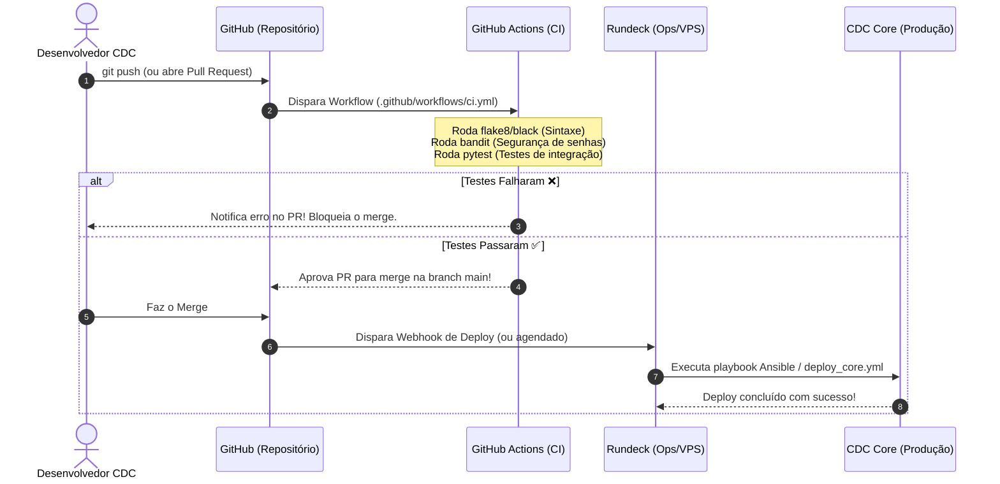

# 🧭 Os 10 Pilares da Engenharia de Plataforma & IA no Ecossistema CDC

Este documento consolida a análise técnica dos **10 pilares da engenharia moderna de software, plataforma e inteligência artificial**, calibrados estritamente para a realidade operacional, restrições orçamentárias de terceiro setor e ferramentas já adotadas pelo **Centro Dom Helder Camara (CDC)** (incluindo **CDC Core**, **Rundeck**, **OpenBao**, **Vaultwarden**, **Rclone**, **VPN**, **Google Workspace** e a iniciativa **Bot CDC / OpenClaw**).

---

## 📊 Matriz Comparativa Completa dos 10 Pilares no CDC

| # | Pilar | O que é | Status Real no CDC | Tecnologias & Ferramentas no CDC | Nível de Maturidade | O que falta / Próximo Passo |
|---|---|---|:---:|---|:---:|---|
| 1 | **Cloud** | Recursos elásticos sob demanda (VMs, storage, bancos) | 🟡 Parcial | VPS Linux (`76.13.227.135`), Rclone para Google Drive / Storages | Operacional Criativo | Snapshot real da VPS e teste de restore drill documentado |
| 2 | **DevOps** | Cultura de automação unindo Dev (CI) e Operações (CD) | 🟡 Parcial | Rundeck (executor/locks), Ansible, Semaphore, Git | Intermediário (Foco Ops) | GitHub Actions (CI) com checagem de sintaxe e testes pré-merge |
| 3 | **IaC** | Infraestrutura declarada e versionada em código | 🟢 Atendido | Terraform (`ops/terraform`), Ansible (`ops/ansible`), OpenBao, Rundeck | Estruturado | Estado do Terraform em backend remoto e segredos dinâmicos |
| 4 | **Containers** | Aplicação isolada em imagem padronizada | 🟢 Atendido | Dockerfile, Docker na VPS, Gunicorn, Whitenoise | Em Produção | Docker Compose orquestrado e container rodando sem usuário root |
| 5 | **Observabilidade** | Métricas, Logs e Traces em tempo real | 🔴 Inicial | Logs locais Gunicorn/Django, playbook `03_system_health.yml` manual | Básico / Reativo | Uptime Kuma (alertas Telegram/Discord), Sentry e rota `/healthz` |
| 6 | **IA Generativa** | Modelos (LLMs) para leitura, síntese e linguagem | 🟡 Em Andamento | `bot.cdc.org.br`, OpenClaw, modelos de visão/linguagem | Piloto / Validação | Saídas estritas em JSON e conexão direta de leitura com o CDC Core |
| 7 | **Context Engineering** | Curadoria e injeção do contexto exato no prompt | 🔴 Inicial | Manuais do CDC, editais e diretrizes documentadas | Teórico / Documental | Banco vetorial (`pgvector` no Postgres) para RAG de normas |
| 8 | **Harness Engineering** | Bancada isolada para testes rápidos e evals de IA | 🔴 Inicial | Testes pontuais no Django | Básico | Mocks offline da API do OngSys e dataset de 50 testes para o bot |
| 9 | **Agentes** | Sistemas autônomos com metas, memória e ferramentas | 🟡 Em Andamento | `bot.cdc.org.br`, OpenClaw, rotinas procedurais no Rundeck | Piloto em estruturação | Camada de ferramentas seguras (APIs de serviço) e Human-in-the-Loop |
| 10 | **Governança** | Segurança, cofres, controle de acessos e conformidade | 🟢 Avançado | OpenBao, Vaultwarden, VPN, Google Workspace APIs, 2FA, RBAC | Maduro e em Expansão | Trilha de auditoria (`django-auditlog`) e conformidade formal LGPD |

---

## 1. ☁️ Cloud (Computação em Nuvem)

### O que é?
O modelo de consumo de infraestrutura (servidores, redes, discos e banco de dados) sob demanda via provedores globais, eliminando equipamentos físicos locais e custos de manutenção de datacenter próprio.

### Como o CDC atende hoje?
* **Realidade:** Devido a restrições de orçamento típicas de ONGs, o CDC adotou uma **arquitetura híbrida e pragmática**: uma VPS em nuvem dedicada aliada ao **Rclone** sincronizando dados para provedores de storage em nuvem (como Google Drive corporativo / storages offsite).
* **Rclone equivale a um Snapshot?**
  * **Não exatamente, mas é um excelente backup offsite em nível de arquivos.**
  * *Diferença técnica:* O **Snapshot de disco** (fornecido pelo painel da VPS/cloud) tira uma foto instantânea do bloco binário inteiro do disco (incluindo memória RAM, SO instalado, permissões Unix e arquivos abertos). É como congelar a máquina no tempo.
  * O **Rclone** atua em nível de arquivo (*file-level* ou *object-level*). Ele copia pastas, dumps do banco de dados e arquivos de mídia para o destino remoto.
  * *Veredito:* Para proteção contra corrupção de arquivos, sequestro de dados (ransomware) ou perda acidental de documentos, o **Rclone é muito eficiente e infinitamente mais barato**. Porém, ele não restaura a máquina inteira em 2 minutos em caso de pane no sistema operacional (você precisará reinstalar o SO e rodar o Ansible/Docker para recolocar os arquivos copiados pelo Rclone).

### Exemplo Prático no CDC:
Uma rotina periódica no cron/Rundeck que gera o `pg_dump` do banco de dados do CDC Core, compacta mídias e executa `rclone sync /backups remote-drive:cdc-backups/core/ --backup-dir remote-drive:cdc-backups/historico/$(date +%Y-%m-%d)`.

### Como podemos melhorar & O que falta:
* **Habilitar Snapshot de disco na VPS (quando viável):** A maioria dos provedores de VPS cobra centavos de dólar/mês para manter 1 snapshot semanal automático da máquina completa.
* **Testes de Restauração (Restore Drill):** Não basta enviar dados com o Rclone; falta uma rotina trimestral documentada de baixar o backup em uma máquina zerada e validar se o banco sobe intacto.

---

## 2. ♾️ DevOps (Desenvolvimento + Operações)

### O que é?
A união entre quem programa (Dev) e quem sustenta a infraestrutura (Ops). O coração do DevOps são os pipelines de **CI/CD**:
* **CI (Continuous Integration):** Toda vez que um dev manda código para o Git, robôs verificam se o código compila, se a sintaxe segue os padrões, se há brechas de segurança e se os testes unitários passaram.
* **CD (Continuous Delivery / Deployment):** Se a CI aprovou, o sistema empacota a aplicação e atualiza o servidor (ou disponibiliza para o executor).

### Como o CDC atende hoje?
* O CDC possui um lado **Ops/Orquestração forte**: usa **Rundeck**, **Ansible** e **Semaphore** para executar tarefas, gerenciar deploys e processar filas (como o processamento do OngSys).
* O ponto cego atual está na **CI (Integração Contínua dentro do Git)**: o código hoje pode ser mergeado no GitHub sem que nenhum robô tenha executado testes automáticos antes.

### Por que e como implantar GitHub Actions junto com o Rundeck?
O GitHub Actions **não substitui o Rundeck**; eles trabalham juntos em etapas complementares:



### Exemplo Prático de Implementação:
Criar o arquivo `.github/workflows/ci.yml`:
1. **Linter & Sintaxe:** `flake8 apps/ config/` (impede código com erros de indentação ou variáveis órfãs).
2. **Segurança de Código:** `pip install bandit && bandit -r apps/` (alerta se alguém deixou uma senha mockada ou chave hardcoded no commit).
3. **Validação do Django:** `python manage.py check` e `pytest` (garante que nenhuma alteração quebrou a leitura dos modelos do banco ou a integração do OngSys).

### Como podemos melhorar & O que falta:
* Integrar o gatilho de sucesso do GitHub Actions para notificar o Rundeck via Webhook seguro com token do OpenBao, automatizando o deploy assim que aprovado.

---

## 3. ⌨️ IaC (Infrastructure as Code) & Divisão de Papéis

### O que é?
Escrever a infraestrutura como arquivos de texto versionados em Git, permitindo recriar todo o ambiente do zero caso a máquina atual exploda.

### A Divisão Clara de Papéis das Ferramentas no CDC:
Para o ecossistema funcionar com clareza sem que uma ferramenta "atropele" a outra, a convenção ideal é:

1. **Terraform:** *O Construtor.* Cria os recursos brutos (cria a VPS, contrata volume de disco, cria chaves SSH públicas, define DNS). Ele não deve configurar serviços internos do Linux.
2. **Ansible:** *O Eletricista e Encanador.* Entra na VPS recém-criada via SSH e instala o Docker, configura Nginx, cria diretórios do sistema, ajusta o firewall (UFW) e prepara os usuários Linux.
3. **OpenBao:** *O Guardião das Chaves.* Armazena de forma criptografada as credenciais de banco, chaves da API Google, tokens do OngSys e segredos de produção.
4. **Rundeck:** *O Maestro e Operador do Painel.* Interface web para executar rotinas, agendar tarefas cron, processar jobs do OngSys e acionar os playbooks do Ansible sem precisar de acesso SSH direto de operadores humanos.
5. **Rclone:** *O Caminhão de Mudança.* Garante o transporte e a sincronização periódica de mídias, backups e relatórios para armazenamento seguro externo.

### Exemplo Prático:
O Terraform cria a máquina; o Ansible roda uma vez para instalar o Docker e a pasta `/etc/cdc/secrets/`; o Rundeck chama o script `python manage.py process_ongsys_task` puxando credenciais seguras do OpenBao; e o Rclone roda de madrugada sincronizando a pasta `/backups` com o Google Drive.

### Como podemos melhorar & O que falta:
* Criar playbooks Ansible dedicados que saibam conversar com a API do OpenBao para injetar variáveis de ambiente temporárias em memória no momento do deploy, sem gravar senhas permanentes em arquivos de texto claro no disco.

---

## 4. 📦 Containers (Docker)

### O que é?
Isolamento da aplicação em processos fechados com sistema de arquivos próprio, garantindo paridade total entre ambiente de desenvolvimento local e o servidor de produção.

### Como o CDC atende hoje?
* O CDC Core já conta com `Dockerfile` funcional e deploy de containers na VPS.

### Exemplo Prático:
Executar a aplicação localmente com `docker build -t cdc-core . && docker run -p 8000:8000 cdc-core` com a certeza de que rodará com a mesma versão do Python, bibliotecas C e dependências que estão no servidor.

### Como podemos melhorar & O que falta:
* **Docker Compose de Produção:** Estruturar um `docker-compose.yml` que orquestre `core`, `redis`, `celery_worker` e `nginx` com rede interna isolada.
* **Volume Persistence e Rclone:** Garantir mapeamento explícito de volumes nomeados do Docker (ex: `postgres_data`, `media_volume`) para que o Rclone faça o espelhamento das pastas certas sem travar arquivos abertos do banco de dados (o banco deve ser espelhado via dump `.sql.gz`).

---

## 5. 📈 Observabilidade

### O que é?
A tríade que permite responder: *"O sistema está saudável agora? Onde está o gargalo quando fica lento? O que causou o erro do usuário X às 14:03?"*. Composta por:
1. **Métricas:** Consumo de RAM, disco, requisições/segundo.
2. **Logs:** Histórico cronológico estruturado de acontecimentos.
3. **Traces:** Acompanhamento do caminho de uma requisição desde que ela bate no Nginx até o banco e volta.

### Como o CDC atende hoje?
* **Diagnóstico confirmado:** Muito básico. Há logs locais nos arquivos do Gunicorn e o playbook `03_system_health.yml` executado manualmente.

### Exemplo Prático:
O CDC Core começa a rejeitar cadastros do transporte porque a tabela de lock do banco ficou presa. Sem observabilidade, a equipe só descobre horas depois quando alguém reclama. Com observabilidade, em 30 segundos um canal do Telegram ou Discord recebe o alerta: *"ALERTA CRÍTICO: 5 requisições 500 consecutivas em /integrations/transportes"*.

### Como podemos melhorar & O que falta:
* **Uptime Kuma (Leve, Gratuito e Auto-hospedado):** Pode rodar em container na VPS; testa o `/` do CDC Core e o `bot.cdc.org.br` a cada 60 segundos e envia aviso no Telegram/WhatsApp se cair.
* **Sentry (Crash Reporting):** Captura qualquer exceção não tratada no Python com o rastreamento da linha de código e variáveis locais.
* **Healthcheck Endpoint no Django:** Criar uma view `/healthz` que testa se a conexão com o banco e o Redis respondem em menos de 200ms.

---

## 6. ✨ IA Generativa vs. 9. 🤖 Agentes (Desfazendo a Confusão)

Como você apontou com muita precisão, as iniciativas **`bot.cdc.org.br`** e **OpenClaw** tocam esses dois pontos, e eles frequentemente se misturam. Vamos separar claramente os conceitos:

```text
┌────────────────────────────────────────────────────────────────────────┐
│ IA GENERATIVA (O "Cérebro" / O Motor Cognitivo)                       │
│ - Modelo de Linguagem (ex: Gemini, Claude, LLaMA, GPT)                 │
│ - Função: Compreender texto/voz, sintetizar, traduzir, resumir, criar. │
│ - Exemplo: "Leia esta ata de reunião e gere um resumo em 3 tópicos."   │
└────────────────────────────────────┬───────────────────────────────────┘
                                     │ é utilizado por
                                     ▼
┌────────────────────────────────────────────────────────────────────────┐
│ AGENTES DE IA (As "Mãos" / O Sistema Operacional Autônomo)             │
│ - Um loop de planejamento + memória + ferramentas (Tool Calling/APIs). │
│ - Função: Tomar decisões em múltiplos passos para cumprir um objetivo. │
│ - Exemplo: "Verifique os comprovantes de transporte do mês, compare    │
│   com o OngSys, gere a folha consolidada e avise o financeiro."       │
│   -> O agente usa ferramentas para ler banco, chamar APIs e enviar msgs│
└────────────────────────────────────────────────────────────────────────┘
```

### Pilar 6: IA Generativa no CDC
* **Onde o `bot.cdc.org.br` / OpenClaw se encaixa:** Quando o bot recebe um áudio, imagem ou texto de um colaborador e utiliza a IA generativa para entender o significado, interpretar a dúvida ou reformatar uma mensagem.
* **Exemplo Prático:** O colaborador manda uma foto borrada de um recibo no WhatsApp/Telegram do bot; a IA generativa lê o texto da foto (OCR semântico), extrai CNPJ, data e valor, e responde: *"Identifiquei recibo de R$ 35,00 do Posto Central em 10/08. Deseja registrar?"*.

### Pilar 9: Agentes de IA no CDC
* **Onde o `bot.cdc.org.br` / OpenClaw se encaixa:** Quando o bot não apenas responde uma pergunta, mas **executa ações no sistema**. Ele possui permissão de chamar a API do CDC Core, consultar tarefas no Rundeck ou criar uma issue no GitHub.
* **Exemplo Prático:**
  1. O usuário diz no bot: *"Rode a sincronização de transportes de ontem e me avise se teve erro."*
  2. O **Agente** planeja:
     * *Passo 1:* Chamar a tool `trigger_rundeck_job("sync_transportes")`.
     * *Passo 2:* Consultar o status da tarefa no banco do Core a cada 30 segundos.
     * *Passo 3:* Se houver inconsistência fiscal, acionar a tool `query_fiscal_divergences()`.
     * *Passo 4:* Compilar o resultado e responder no chat para o usuário com o PDF anexado.

### Como podemos melhorar & O que falta:
* Criar uma camada segura de **Tool Calling** (funções OpenAPI/JSON) no CDC Core com permissões limitadas, permitindo que o bot OpenClaw execute consultas sem ter acesso direto irrestrito ao banco de dados.

---

## 7. 🧠 Context Engineering (Engenharia de Contexto)

### O que é?
A arte e técnica de fornecer **exatamente as informações necessárias** para a IA no momento do prompt. Nem informação de menos (que gera alucinações e respostas genéricas), nem informação demais (que estoura o custo de tokens e confunde o modelo).

Envolve:
* **System Prompts estruturados:** Papéis e regras rígidas ("Você é o auditor financeiro do CDC. Nunca invente dados...").
* **RAG (Retrieval-Augmented Generation):** Banco vetorial que busca pedaços de manuais e regulamentos do CDC antes de responder.
* **Injeção de Estado Dinâmico:** Injetar no prompt quem é o usuário autenticado, seus privilégios e os projetos aos quais tem acesso.

### Exemplo Prático no CDC:
Quando um assistente social pergunta ao `bot.cdc.org.br`: *"Posso usar a verba de alimentação para lanche de oficina no projeto Girassol?"*, a engenharia de contexto injeta automaticamente no prompt o trecho exato do **Termo de Fomento do Projeto Girassol** e a **Instrução Normativa Interna do CDC**, permitindo à IA responder categoricamente: *"Sim, conforme a Cláusula 4ª, parágrafo 2º, até o limite de R$ 15,00 por participante"*.

### Como podemos melhorar & O que falta:
* Estruturar um pipeline de documentos: converter PDFs de projetos, manuais de compras e regulamentos do CDC em *chunks* (trechos) com embeddings e busca semântica simples (ex: `pgvector` no próprio PostgreSQL do Core).

---

## 8. ⚙️ Harness Engineering (Engenharia de Harness / Evals) — *Aprofundamento Detalhado*

Como você solicitou mais explicações sobre esse conceito, vamos dissecar o que significa:

### O que significa a palavra "Harness"?
Na engenharia mecânica e de aviação, um *harness* é o chicote de fiação de testes ou a estrutura de fixação que segura um motor numa bancada para testá-lo em condições extremas antes de colocá-lo no avião.
Na engenharia de software e IA, um **Test Harness (Arnês de Teste)** é a infraestrutura auxiliar que **isola, simula e testa componentes de forma reproduzível**.

O Harness se divide em duas frentes fundamentais:

```text
                    ┌──────────────────────────────────────────────┐
                    │            HARNESS ENGINEERING               │
                    └──────────────────────┬───────────────────────┘
                                           │
             ┌─────────────────────────────┴─────────────────────────────┐
             ▼                                                           ▼
┌────────────────────────────────────────┐  ┌────────────────────────────────────────┐
│ 1. HARNESS DE SOFTWARE TRADICIONAL     │  │ 2. HARNESS DE IA & EVALS (AVALIAÇÃO)   │
│ - Mocks, Fixtures e Simuladores        │  │ - Datasets de Perguntas/Respostas Ouro │
│ - Banco de dados isolado em memória    │  │ - Métricas de Acurácia e Assertividade │
│ - Simulação de APIs externas (OngSys)  │  │ - Detecção de Alucinações / Deriva      │
└────────────────────────────────────────┘  └────────────────────────────────────────┘
```

### 1. Harness de Software Tradicional (Por que é vital para o CDC?)
* **O Problema:** Hoje, para testar se a rotina do OngSys (`ongsys_sync.py`) funciona, você quase sempre precisa bater no OngSys real. Se o OngSys estiver fora do ar ou com instabilidade, você não sabe se o seu código quebrou ou se foi a internet.
* **A Solução com Harness:** Criar **mocks** (respostas gravadas em JSON da API do OngSys). O seu teste roda contra esse simulador falso instantaneamente no computador ou no GitHub Actions em 3 segundos, sem precisar de internet ou credenciais reais.

### 2. Harness de IA / Evals (Por que é vital para o Bot CDC?)
* **O Problema:** Ao mudar o prompt do bot ou trocar de modelo de IA, você não tem como saber se ele piorou em outros assuntos sem testar manualmente 100 perguntas.
* **A Solução com Harness de IA:**
  * Você cria uma planilha/JSON com **50 casos de teste reais** (ex: 10 perguntas de transporte, 10 de prestação de contas, 10 de faltas de educadores, 20 de dúvidas gerais com suas respectivas "respostas ideais").
  * Toda vez que você altera o código do bot ou o prompt, o **Harness de Avaliação** executa todas as 50 perguntas automaticamente e gera uma nota: *"Acurácia: 96%. Atenção: o bot errou a pergunta #14 sobre diárias"*.

### Exemplo Prático no CDC:
Uma pasta `tests/harness/` com um arquivo `test_ongsys_responses.json`. Quando o desenvolvedor roda `pytest`, o harness intercepta a chamada de rede, entrega o JSON mockado e valida se o CDC Core salvou os registros contábeis perfeitamente.

### Como podemos melhorar & O que falta:
* Adicionar bibliotecas de mock (`responses` ou `unittest.mock`) nas suítes de teste do Django.
* Criar a primeira lista de 20 perguntas e respostas padrão para o `bot.cdc.org.br` para servir de baseline de qualidade.

---

## 10. 🛡️ Governança, Identidade & Segurança

### O que é?
A garantia de que a organização tem controle absoluto sobre quem acessa quais dados, onde as chaves e credenciais estão guardadas, auditoria contínua de ações administrativas e conformidade legal (LGPD e prestação de contas públicas).

### Como o CDC atende hoje? (Panorama Ampliado com seus apontamentos)
O CDC já possui um ecossistema de segurança muito superior à média do terceiro setor:
1. **OpenBao:** Gerenciamento de credenciais de máquina, tokens de API e certificados (fork livre do Vault).
2. **Vaultwarden:** Gerenciador de senhas corporativas para a equipe operacional e administrativa, eliminando senhas em planilhas ou post-its.
3. **VPN (Rede Privada):** Acesso a serviços e bancos de dados restritos apenas por túnel criptografado, sem portas de banco abertas para a internet pública.
4. **Google Workspace APIs & Gestão de Domínio CDC:** Automação de ciclo de vida de contas corporativas `@cdc.org.br` (onboarding/offboarding).
5. **Telemetria de Segurança & 2FA:** Expansão da obrigatoriedade de autenticação em 2 fatores nas contas Google e início da coleta de logs de atividade.

### Exemplo Prático no CDC:
Um novo operador de dados entra no projeto. Via API do Google Workspace sua conta é provisionada; seus acessos a senhas compartilhadas são liberados no Vaultwarden com 2FA obrigatório; para acessar o Rundeck ou a VPS ele se conecta pela VPN; e o script do CDC Core consome o token da API fiscal puxando do OpenBao em tempo de execução sem que o operador jamais veja a senha em texto claro.

### Como podemos melhorar & O que falta:
* **Trilha de Auditoria no Banco do Django:** O Django por padrão não registra *o que foi alterado* em cada registro. Falta instalar `django-auditlog` para auditar alterações em tabelas fiscais e financeiras (ex: quem alterou o valor de um lançamento de transporte e qual era o valor antigo).
* **Adequação Formal à LGPD para Beneficiários:** Criar no sistema a política de expurgo ou anonimização de dados de crianças, adolescentes e famílias atendidas após o encerramento do convênio público.
* **Centralização da Telemetria de Segurança:** Puxar os eventos de login suspeito das APIs do Google Workspace para uma rotina no Core que alerte o administrador caso uma conta corporativa faça login em país incomum.

---

## 💡 Sugestões Práticas de Aplicação (Roadmap Estratégico)

Aqui estão sugestões objetivas de ações ordenadas por impacto e viabilidade, respeitando a realidade de equipe e custos do CDC:

### 🎯 Curto Prazo (Impacto Rápido & Custo Zero)

1. **GitHub Actions no repositório `dxcdc/core`:**
   * Criar `.github/workflows/ci.yml` rodando `flake8` e `python manage.py check`.
   * **Ganho:** Impede que commits com erros de sintaxe ou imports quebrados cheguem à branch `main` e quebrem o Rundeck/VPS.
2. **Healthcheck e Monitoramento com Uptime Kuma:**
   * Subir um container do Uptime Kuma na VPS monitorando a rota principal do CDC Core e o `bot.cdc.org.br`.
   * Configurar notificação gratuita via bot do Telegram.
   * **Ganho:** Fim do monitoramento "no escuro"; alerta imediato se o bot ou o Core pararem de responder.
3. **Auditoria de Banco de Dados com `django-auditlog`:**
   * Adicionar ao `requirements.txt` e plugar nos models de integração e finanças.
   * **Ganho:** Conformidade imediata para prestação de contas com órgãos públicos e financiadores.

### 🚀 Médio Prazo (Consolidação da Infraestrutura & Dados)

4. **Padronização da Integração OpenBao + Rundeck + CDC Core:**
   * Criar padrão para que o job do Rundeck autentique no OpenBao via AppRole, receba o token dinâmico temporário e execute as tasks sem deixar arquivos de ambiente perenes desprotegidos.
5. **Estruturar o "Harness" de Testes do OngSys:**
   * Gravar 5 payloads reais anonimizados de notas fiscais e relatórios do OngSys em arquivos JSON.
   * Criar testes com `@responses.activate` para validar as rotinas de sincronização sem depender da rede.
   * **Ganho:** Segurança total para refatorar código de sincronização sem medo de corromper dados reais.
6. **Evolução do Rclone com Versionamento Histórico:**
   * Ajustar a rotina do Rclone para usar a flag `--backup-dir`, garantindo que arquivos modificados ou deletados sejam arquivados em pastas datadas (ex: `/historico/2026-09/`), protegendo contra exclusões acidentais ou ataques.

### 🤖 Longo Prazo (Ecossistema de IA Seguro & Produtivo)

7. **API Gateway / Tooling Layer para o `bot.cdc.org.br` / OpenClaw:**
   * Criar endpoints dedicados no CDC Core protegidos por token de serviço com escopo mínimo para o bot.
   * O bot não deve acessar banco de dados diretamente; ele consulta rotas como `/api/v1/bot/resumo-tarefas/` ou `/api/v1/bot/status-ongsys/`.
8. **Base de Conhecimento RAG do CDC (Engenharia de Contexto):**
   * Configurar `pgvector` no PostgreSQL existente do Core.
   * Criar um script para indexar os manuais de procedimentos, regimentos internos e editais do CDC.
   * O bot passa a consultar essa base antes de responder perguntas institucionais, operando com precisão de normas.
9. **Bancada de Evals (Harness de IA):**
   * Manter uma lista de perguntas padrão e respostas ideais para rodar a cada atualização do modelo ou prompt do bot.
